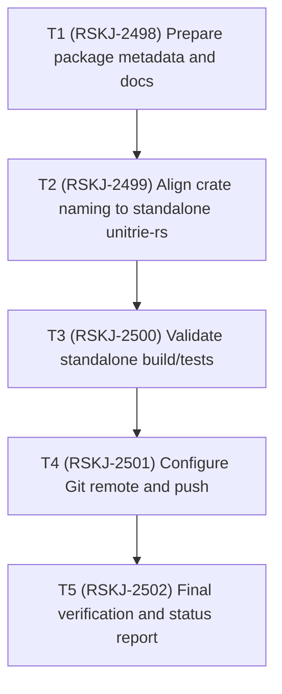

# Unitrie-rs Publish TODO

Status date: 2026-02-14

## Dependency graph

## Execution TODO list

- [x] `T1` `status: done` `depends_on: []` `jira: RSKJ-2498`
  - Add production-ready README/licensing metadata for the standalone core crate.
- [x] `T2` `status: done` `depends_on: [T1]` `jira: RSKJ-2499`
  - Rename crate package/import path to `unitrie-rs` and update internal references.
- [x] `T3` `status: done` `depends_on: [T2]` `jira: RSKJ-2500`
  - Run `cargo test` and ensure bench target still resolves.
- [ ] `T4` `status: in_progress` `depends_on: [T3]` `jira: RSKJ-2501`
  - Set `origin` to `git@github.com:fedejinich/unitire-rs.git` and push `main`.
- [ ] `T5` `status: todo` `depends_on: [T4]` `jira: RSKJ-2502`
  - Confirm remote state and finalize publication status.
