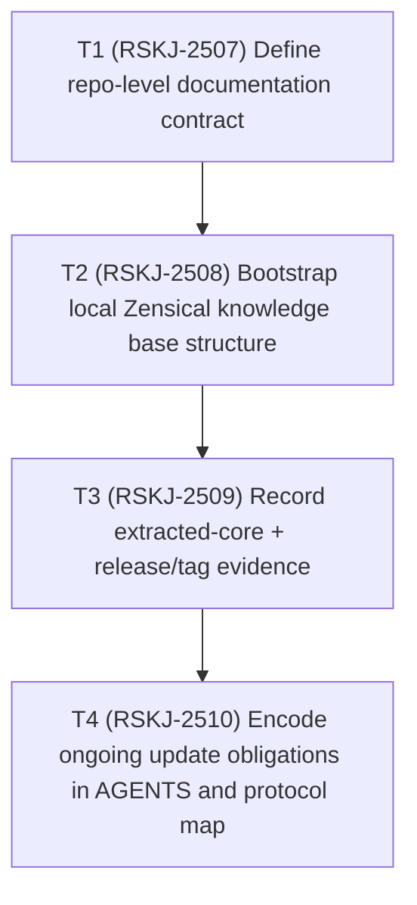

# TODO-CODEX

Status date: 2026-02-14

## Dependency graph

## Execution TODO list

- [x] `T1` `status: done` `depends_on: []` `jira: RSKJ-2507`
  - Define explicit policy that every work batch must update TODO-CODEX, AGENTS, and Zensical KB.
- [x] `T2` `status: done` `depends_on: [T1]` `jira: RSKJ-2508`
  - Create `/docs/knowledge/zensical` structure for reusable unitrie-rs project evidence.
- [x] `T3` `status: done` `depends_on: [T2]` `jira: RSKJ-2509`
  - Register modular extraction, publication, and `v0.1.0` tag evidence in `.md` and `.json` artifacts.
- [x] `T4` `status: done` `depends_on: [T3]` `jira: RSKJ-2510`
  - Encode documentation update obligations in AGENTS and Zensical protocol map.

## Ongoing rule
Every future task must append an entry to:
1. `docs/knowledge/zensical/evidence/project/worklog.md`
2. `docs/knowledge/zensical/evidence/project/worklog.json`
and reflect corresponding status changes in this TODO.
